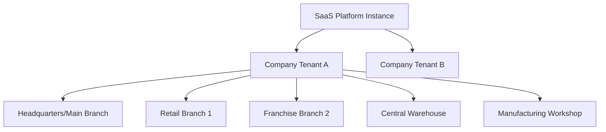
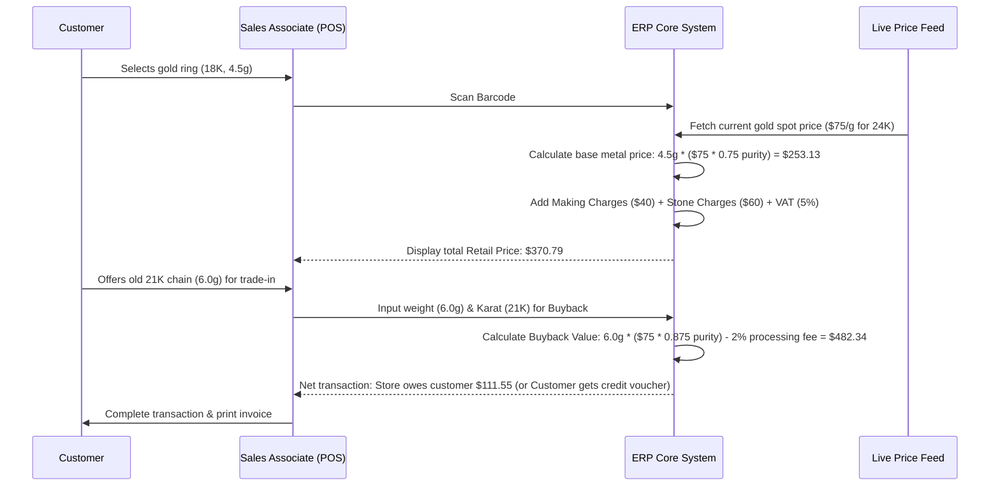

# Business Requirement Document (BRD)
## Multi-Tenant Gold & Jewelry SaaS ERP System

---

## 1. Executive Summary & Business Goals

The Gold & Jewelry retail and manufacturing industry operates on unique paradigms. Unlike traditional retail where inventory cost is static, a jewelry business deals with commodities (Gold, Silver, Platinum, Diamonds, and Precious Stones) whose market value fluctuates minute-by-minute. A complete Multi-Tenant SaaS ERP system for this industry must serve as a financial ledger, a manufacturing tracking system, a multi-branch inventory auditor, and a real-time price calculator.

### Core Business Goals
* **Real-Time Metal Valuation**: Continuously calculate the exact asset value of inventory across multiple branches based on fluctuating live metal prices and stone valuations.
* **Granular Weight Auditability**: Track gold and precious metals up to 4 decimal places in grams to prevent shrinkages and fraud.
* **Unified Multi-Branch operations**: Sync inventory, stock transfers, repair orders, and sales commissions across franchise and corporate-owned branches.
* **Dynamic Costing**: Automate product pricing by decoupling metal value (Live Spot Price × Weight × Karat Purity) from Making Charges (labor), Wastage (metal loss), and Stone Charges.
* **Consignment & Memo Management**: Support intake of supplier goods on consignment ("memo") and outgoing consignment to third-party retailers with distinct settlement rules.
* **Regulatory Compliance**: Ensure robust KYC (Know Your Customer) tracking for gold buyback and recycling, anti-money laundering (AML) checks, and generation of tax-compliant invoices.

---

## 2. Company & Branch Organizational Structure

The system is designed to support complex multi-tenant hierarchies, allowing single SaaS subscriptions to represent large conglomerates, franchise operations, or individual boutiques.

### Entity Hierarchy
1. **Tenant (Company)**: The highest logical boundary. Complete data isolation. Has its own base currency, default metal accounts, subscription plan, and configurations.
2. **Branch/Location**:
   * **Headquarters (HQ)**: Central admin unit controlling master settings, global catalog, and consolidation of accounting.
   * **Retail Branch**: Standard store containing physical POS registers, showcases, and branch-specific gold stock.
   * **Warehouse**: Storage-only facility for raw metals, loose stones, or backstock items.
   * **Workshop/Goldsmith Studio**: Internal or external manufacturing units where gold is melted, cast, set, and polished.

---

## 3. User Personas

### 3.1. Executive / Company Owner (e.g., "Amir")
* **Role**: Admin / Business Owner.
* **Goal**: Monitor profitability across all branches, audit total gold holding weight, adjust markup rates, and monitor staff performance.
* **Key Tasks**: View consolidated financial dashboards, approve large supplier purchases, adjust overall brand parameters, review audit trails.

### 3.2. Inventory Manager (e.g., "Elena")
* **Role**: Catalog & Inventory controller.
* **Goal**: Keep stock levels optimal, audit precious stone counts, coordinate branch transfers, print barcodes, and manage certificates.
* **Key Tasks**: Create product templates, upload GIA/IGI certificates, approve stock transfers, run stock reconciliation audits.

### 3.3. Sales Associate (e.g., "Raj")
* **Role**: POS Operator / Front-desk consultant.
* **Goal**: Deliver fast customer checkout, execute gold exchange deals, handle repair requests, and track personal sales commissions.
* **Key Tasks**: Look up gold rate of the hour, calculate custom discount limits, scan item barcodes, process cash/card/gold-exchange payments, register customer KYC.

### 3.4. Workshop Supervisor / Goldsmith (e.g., "Marco")
* **Role**: Manufacturing and craft worker.
* **Goal**: Track gold weight through refining, casting, stone-setting, and polishing to minimize wastage.
* **Key Tasks**: Receive job cards, log raw material weights, report finished item weights, record gold melting losses (wastage).

---

## 4. Roles & Permissions Matrix

The system implements Role-Based Access Control (RBAC) defined at the company level. Custom roles can be created, but default roles are predefined.

| Module | Super Admin (Tenant Owner) | Inventory Manager | Sales Associate | Branch Manager | Workshop Supervisor |
| :--- | :---: | :---: | :---: | :---: | :---: |
| **Tenant Settings** | Full Access | No Access | No Access | No Access | No Access |
| **Gold Karat / Price Rules**| Full Access | View Only | View Only | Modify (Within Limits) | View Only |
| **Products & Categories** | Full Access | Full Access | View Only | View Only | View Only |
| **Inventory / Stock Audits**| Full Access | Full Access | View Only (Own Branch) | Full Access (Branch) | View Only (Workshop) |
| **Sales & POS** | Full Access | View Only | Create / View Own | Full Access (Branch) | No Access |
| **Gold Buyback & Exchanges**| Full Access | No Access | Create / Draft | Full Access (Branch) | No Access |
| **Manufacturing Logs** | Full Access | View Only | No Access | No Access | Full Access |
| **Accounting & Expenses** | Full Access | No Access | No Access | Create Expense | No Access |
| **Audit Logs** | Full Access | No Access | No Access | No Access | No Access |

---

## 5. Daily Operations & Core Workflows

### 5.1. The POS Sales Workflow (with Gold Exchange)

### 5.2. Gold Melting & Refining Workflow
In jewelry manufacturing, scrap gold must be collected and melted down to create standard gold bars or castings.
1. **Scrap Collection**: Damaged goods, customer trade-ins, and shop-floor wastage are collected.
2. **Weight Measurement**: Pre-melt weight is measured and recorded (e.g., 100.50 grams of 18K gold).
3. **Melting**: The metal is melted in the workshop furnace.
4. **Post-Melt Weight**: The refined bar is weighed. Due to oxidation or impurities, weight loss occurs (e.g., 99.85 grams).
5. **Wastage Recording**: The difference (0.65g, or 0.64%) is logged as melting loss and adjusted in the general ledger.

### 5.3. Jewelry Repair Orders
1. **Intake**: Customer brings a broken diamond ring. The associate weighs the ring (including stones) and takes photos.
2. **Job Assignment**: The system generates a repair barcode and assigns the task to a designated goldsmith.
3. **Materials Allocations**: If additional gold (e.g., 18K solder, 0.5g) or accent diamonds are required, they are allocated from inventory.
4. **Completion**: The goldsmith finishes the repair, enters the final weight, and records any metal loss.
5. **Quality Control**: QC verification is done, and the customer is notified via SMS/WhatsApp for collection and payment of service fees.

---

## 6. Pain Points & Solutions

| Pain Point | Industry Consequence | SaaS ERP Solution |
| :--- | :--- | :--- |
| **Fluctuating Gold Prices** | Underpricing items or losing money during gold market spikes. | **Live Pricing Integration**: Automatically calculates retail prices based on real-time gold feeds combined with fixed labor margins. |
| **Inventory Shrinkage** | Unexplained metal weight losses due to theft or poor workshop tracking. | **Dual-Unit Tracking**: Tracks all raw and finished inventory by both count (pcs) and weight (grams to 4 decimal places) with serial logs. |
| **Complex Costing Structure** | Difficulty separating metal cost from workmanship, wastage, and stone costs. | **Cost Break-Down Engine**: Separates item pricing into base metal price, making charges per gram/fixed, wastage percentage, and stone details. |
| **Complicated Trade-Ins** | Human errors in determining buyback values of old jewelry with unknown purity. | **Structured Buyback Module**: Integrates karat testers inputs, enforces weight checks, applies standard discount/refining formulas, and prompts KYC verification. |
| **Audit Trails for Regulators** | Heavy compliance penalties for cash transactions and scrap gold tracking. | **Immutable Audit Logs**: Logs every inventory movement, user login, POS price modification, and cash drawer opening. |

---

## 7. SaaS Pricing Plans & Monetization

To successfully monetize this platform, a tiered subscription model combined with feature flag limitations is designed:

### 7.1. Tier 1: Basic (Boutique Shop)
* **Target**: Single boutique retail stores.
* **Pricing**: $99 / month.
* **Limits**: 1 Branch, up to 3 Users, 1,000 active inventory items.
* **Included Modules**: Authentication, Products, Sales POS, Customers, Basic Reports, Email notifications.
* **Exclusions**: Live Gold Price API (manual updates only), Manufacturing, Advanced Audit Logs, Custom Branding.

### 7.2. Tier 2: Professional (Multi-Branch Retailer)
* **Target**: Growing retail networks.
* **Pricing**: $299 / month.
* **Limits**: Up to 5 Branches, 15 Users, 10,000 inventory items.
* **Included Modules**: Everything in Basic + Stock Transfers, Live Gold Price Integration, Gold Exchange, Repair Orders, WhatsApp/SMS alerts, Supplier Management, Expenses.

### 7.3. Tier 3: Enterprise (Large Chains & Manufacturers)
* **Target**: Large jewelry houses with internal manufacturing workshops.
* **Pricing**: $799 / month (Billed Annually) or Custom Quote.
* **Limits**: Unlimited Branches, Unlimited Users, Unlimited Inventory.
* **Included Modules**: Everything in Professional + Jewelry Manufacturing, Gold Melting Records, Certificate Management, Complete Accounting module (Ledgers, P&L), Dedicated Database (optional), API Access, Custom branding / White-labeling.

### 7.4. Upselling & Add-On Strategy
* **Branch Pack**: +$50/month per additional branch above tier limits.
* **User Pack**: +$15/month per additional user.
* **Live Gold API Upgrade**: +$20/month for real-time market gold price sync from premium feeds.
* **White-Label Portal**: +$199/month to host the app under the company's custom domain and branding colors.
