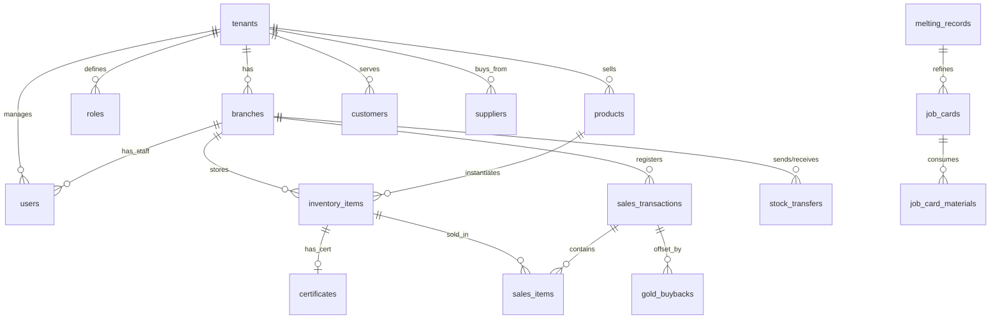

# Database Design Document
## Multi-Tenant Gold & Jewelry SaaS ERP System

---

## 1. Database Architecture & Multi-Tenancy Strategy

To support up to 10,000 companies (tenants) efficiently and cost-effectively, this system utilizes a **Shared Database with Column-Based Tenant Isolation**. 
* Every tenant-specific table contains a `tenant_id` column.
* PostgreSQL **Row-Level Security (RLS)** is enabled on all tenant-specific tables to enforce that query sessions can never read or write data belonging to another tenant.
* High-volume transaction tables are partitioned by both `tenant_id` and date range to optimize index sizes and retrieval speeds.

### Row-Level Security (RLS) Implementation Pattern
```sql
-- Enforce Row-Level Security on a table
ALTER TABLE inventory_items ENABLE ROW LEVEL SECURITY;

-- Create policy based on tenant_id set in the application context (e.g. current_setting('app.current_tenant_id'))
CREATE POLICY tenant_isolation_policy ON inventory_items
    FOR ALL
    USING (tenant_id = NULLIF(current_setting('app.current_tenant_id', true), '')::UUID);
```

---

## 2. Entity Relationship Diagram (ERD)



---

## 3. PostgreSQL Database Schema (DDL)

Here is the production-ready DDL script reflecting relationships, primary/foreign keys, precision fields, and check constraints.

```sql
-- Enable UUID extension
CREATE EXTENSION IF NOT EXISTS "uuid-ossp";

-- =========================================================================
-- 1. TENANTS & CORE CONFIG
-- =========================================================================
CREATE TABLE tenants (
    id UUID PRIMARY KEY DEFAULT uuid_generate_v4(),
    name VARCHAR(255) NOT NULL,
    subdomain VARCHAR(100) UNIQUE NOT NULL,
    base_currency CHAR(3) DEFAULT 'USD',
    base_weight_unit VARCHAR(10) DEFAULT 'gram', -- gram, oz, pennyweight
    logo_url VARCHAR(1024),
    is_active BOOLEAN DEFAULT TRUE,
    created_at TIMESTAMPTZ DEFAULT CURRENT_TIMESTAMP,
    updated_at TIMESTAMPTZ DEFAULT CURRENT_TIMESTAMP
);

CREATE TABLE branches (
    id UUID PRIMARY KEY DEFAULT uuid_generate_v4(),
    tenant_id UUID NOT NULL REFERENCES tenants(id) ON DELETE CASCADE,
    name VARCHAR(150) NOT NULL,
    branch_type VARCHAR(50) DEFAULT 'retail', -- retail, warehouse, workshop, consignment
    address TEXT,
    phone VARCHAR(30),
    is_active BOOLEAN DEFAULT TRUE,
    created_at TIMESTAMPTZ DEFAULT CURRENT_TIMESTAMP,
    updated_at TIMESTAMPTZ DEFAULT CURRENT_TIMESTAMP
);

-- =========================================================================
-- 2. USERS, ROLES & SECURITY
-- =========================================================================
CREATE TABLE roles (
    id UUID PRIMARY KEY DEFAULT uuid_generate_v4(),
    tenant_id UUID NOT NULL REFERENCES tenants(id) ON DELETE CASCADE,
    name VARCHAR(50) NOT NULL,
    permissions JSONB NOT NULL DEFAULT '{}',
    is_system BOOLEAN DEFAULT FALSE,
    created_at TIMESTAMPTZ DEFAULT CURRENT_TIMESTAMP,
    UNIQUE(tenant_id, name)
);

CREATE TABLE users (
    id UUID PRIMARY KEY DEFAULT uuid_generate_v4(),
    tenant_id UUID NOT NULL REFERENCES tenants(id) ON DELETE CASCADE,
    role_id UUID NOT NULL REFERENCES roles(id),
    name VARCHAR(150) NOT NULL,
    email VARCHAR(255) NOT NULL,
    password_hash VARCHAR(255) NOT NULL,
    home_branch_id UUID REFERENCES branches(id),
    is_active BOOLEAN DEFAULT TRUE,
    created_at TIMESTAMPTZ DEFAULT CURRENT_TIMESTAMP,
    updated_at TIMESTAMPTZ DEFAULT CURRENT_TIMESTAMP,
    UNIQUE(tenant_id, email)
);

-- Many-to-many user branch mapping for employees covering shifts elsewhere
CREATE TABLE user_branches (
    user_id UUID REFERENCES users(id) ON DELETE CASCADE,
    branch_id UUID REFERENCES branches(id) ON DELETE CASCADE,
    PRIMARY KEY (user_id, branch_id)
);

-- =========================================================================
-- 3. CRM & SUPPLIERS
-- =========================================================================
CREATE TABLE customers (
    id UUID PRIMARY KEY DEFAULT uuid_generate_v4(),
    tenant_id UUID NOT NULL REFERENCES tenants(id) ON DELETE CASCADE,
    name VARCHAR(150) NOT NULL,
    phone VARCHAR(30),
    email VARCHAR(255),
    id_type VARCHAR(50), -- Passport, Driving License, National ID
    id_number VARCHAR(100),
    gold_balance_grams NUMERIC(12, 4) DEFAULT 0.0000, -- Depository metal account
    cash_balance NUMERIC(15, 2) DEFAULT 0.00,
    created_at TIMESTAMPTZ DEFAULT CURRENT_TIMESTAMP
);

CREATE TABLE suppliers (
    id UUID PRIMARY KEY DEFAULT uuid_generate_v4(),
    tenant_id UUID NOT NULL REFERENCES tenants(id) ON DELETE CASCADE,
    company_name VARCHAR(150) NOT NULL,
    contact_name VARCHAR(150),
    phone VARCHAR(30),
    email VARCHAR(255),
    gold_receivable_grams NUMERIC(12, 4) DEFAULT 0.0000, -- Gold ounces/grams owed to supplier
    cash_payable NUMERIC(15, 2) DEFAULT 0.00,
    created_at TIMESTAMPTZ DEFAULT CURRENT_TIMESTAMP
);

-- =========================================================================
-- 4. PRODUCTS & LIVE VALUES
-- =========================================================================
CREATE TABLE categories (
    id UUID PRIMARY KEY DEFAULT uuid_generate_v4(),
    tenant_id UUID NOT NULL REFERENCES tenants(id) ON DELETE CASCADE,
    parent_id UUID REFERENCES categories(id) ON DELETE SET NULL,
    name VARCHAR(100) NOT NULL,
    default_making_charge_gram NUMERIC(10, 2) DEFAULT 0.00,
    default_wastage_percent NUMERIC(5, 2) DEFAULT 0.00,
    created_at TIMESTAMPTZ DEFAULT CURRENT_TIMESTAMP
);

CREATE TABLE products (
    id UUID PRIMARY KEY DEFAULT uuid_generate_v4(),
    tenant_id UUID NOT NULL REFERENCES tenants(id) ON DELETE CASCADE,
    category_id UUID REFERENCES categories(id) ON DELETE SET NULL,
    sku VARCHAR(100) NOT NULL,
    name VARCHAR(255) NOT NULL,
    metal_type VARCHAR(30) DEFAULT 'gold', -- gold, platinum, silver
    karat VARCHAR(10) DEFAULT '21K', -- 18K, 21K, 22K, 24K
    standard_making_charge NUMERIC(10, 2) DEFAULT 0.00,
    making_charge_type VARCHAR(20) DEFAULT 'per_gram', -- per_gram, fixed
    standard_wastage_percent NUMERIC(5, 2) DEFAULT 0.00,
    description TEXT,
    created_at TIMESTAMPTZ DEFAULT CURRENT_TIMESTAMP,
    UNIQUE(tenant_id, sku)
);

CREATE TABLE gold_price_history (
    id UUID PRIMARY KEY DEFAULT uuid_generate_v4(),
    tenant_id UUID NOT NULL REFERENCES tenants(id) ON DELETE CASCADE,
    karat VARCHAR(10) NOT NULL, -- 18K, 21K, 22K, 24K
    price_per_gram NUMERIC(12, 4) NOT NULL,
    currency CHAR(3) DEFAULT 'USD',
    source VARCHAR(100) DEFAULT 'feed_api',
    recorded_at TIMESTAMPTZ DEFAULT CURRENT_TIMESTAMP
);

-- =========================================================================
-- 5. INVENTORY & CERTIFICATES
-- =========================================================================
CREATE TABLE inventory_items (
    id UUID PRIMARY KEY DEFAULT uuid_generate_v4(),
    tenant_id UUID NOT NULL REFERENCES tenants(id) ON DELETE CASCADE,
    branch_id UUID NOT NULL REFERENCES branches(id),
    product_id UUID REFERENCES products(id),
    barcode VARCHAR(100) UNIQUE NOT NULL,
    gross_weight NUMERIC(12, 4) NOT NULL CHECK (gross_weight > 0),
    net_gold_weight NUMERIC(12, 4) NOT NULL CHECK (net_gold_weight <= gross_weight),
    stone_weight NUMERIC(12, 4) DEFAULT 0.0000, -- Gross - Net weight
    gold_karat VARCHAR(10) NOT NULL DEFAULT '21K',
    making_charge_rate NUMERIC(10, 2) DEFAULT 0.00,
    making_charge_type VARCHAR(20) DEFAULT 'per_gram',
    stone_charge NUMERIC(15, 2) DEFAULT 0.00,
    wastage_percent NUMERIC(5, 2) DEFAULT 0.00,
    status VARCHAR(50) DEFAULT 'in_stock', -- in_stock, sold, transferred, refining, repair
    created_at TIMESTAMPTZ DEFAULT CURRENT_TIMESTAMP,
    updated_at TIMESTAMPTZ DEFAULT CURRENT_TIMESTAMP
);

CREATE TABLE certificates (
    id UUID PRIMARY KEY DEFAULT uuid_generate_v4(),
    tenant_id UUID NOT NULL REFERENCES tenants(id) ON DELETE CASCADE,
    inventory_item_id UUID UNIQUE REFERENCES inventory_items(id) ON DELETE CASCADE,
    agency VARCHAR(50) NOT NULL, -- GIA, IGI, HRD
    certificate_number VARCHAR(100) NOT NULL,
    carat_weight NUMERIC(8, 3) NOT NULL,
    clarity VARCHAR(20),
    color VARCHAR(20),
    cut VARCHAR(20),
    certificate_pdf_url VARCHAR(1024),
    created_at TIMESTAMPTZ DEFAULT CURRENT_TIMESTAMP
);

-- =========================================================================
-- 6. STOCK TRANSFERS
-- =========================================================================
CREATE TABLE stock_transfers (
    id UUID PRIMARY KEY DEFAULT uuid_generate_v4(),
    tenant_id UUID NOT NULL REFERENCES tenants(id) ON DELETE CASCADE,
    from_branch_id UUID NOT NULL REFERENCES branches(id),
    to_branch_id UUID NOT NULL REFERENCES branches(id),
    transfer_status VARCHAR(50) DEFAULT 'pending', -- pending, transit, received, rejected
    requested_by UUID REFERENCES users(id),
    approved_by UUID REFERENCES users(id),
    created_at TIMESTAMPTZ DEFAULT CURRENT_TIMESTAMP,
    updated_at TIMESTAMPTZ DEFAULT CURRENT_TIMESTAMP
);

CREATE TABLE stock_transfer_items (
    id UUID PRIMARY KEY DEFAULT uuid_generate_v4(),
    transfer_id UUID NOT NULL REFERENCES stock_transfers(id) ON DELETE CASCADE,
    inventory_item_id UUID NOT NULL REFERENCES inventory_items(id)
);

-- =========================================================================
-- 7. SALES & POS
-- =========================================================================
CREATE TABLE sales_transactions (
    id UUID PRIMARY KEY DEFAULT uuid_generate_v4(),
    tenant_id UUID NOT NULL REFERENCES tenants(id) ON DELETE CASCADE,
    branch_id UUID NOT NULL REFERENCES branches(id),
    customer_id UUID REFERENCES customers(id),
    user_id UUID NOT NULL REFERENCES users(id), -- cashier
    invoice_number VARCHAR(100) UNIQUE NOT NULL,
    gold_rate_applied_24k NUMERIC(12, 4) NOT NULL, -- Reference rate
    subtotal NUMERIC(15, 2) NOT NULL,
    tax_amount NUMERIC(15, 2) DEFAULT 0.00,
    discount_amount NUMERIC(15, 2) DEFAULT 0.00,
    total_amount NUMERIC(15, 2) NOT NULL,
    payment_status VARCHAR(50) DEFAULT 'paid', -- paid, partial, unpaid
    created_at TIMESTAMPTZ DEFAULT CURRENT_TIMESTAMP
);

CREATE TABLE sales_items (
    id UUID PRIMARY KEY DEFAULT uuid_generate_v4(),
    sales_transaction_id UUID NOT NULL REFERENCES sales_transactions(id) ON DELETE CASCADE,
    inventory_item_id UUID NOT NULL REFERENCES inventory_items(id),
    gold_rate_applied NUMERIC(12, 4) NOT NULL, -- Rate for the item karat
    metal_value_calculated NUMERIC(15, 2) NOT NULL,
    making_charge_applied NUMERIC(15, 2) NOT NULL,
    stone_charge_applied NUMERIC(15, 2) NOT NULL,
    final_item_price NUMERIC(15, 2) NOT NULL
);

-- =========================================================================
-- 8. INDUSTRY OPERATIONS ( melting, buybacks, repairs, job cards)
-- =========================================================================
CREATE TABLE gold_buybacks (
    id UUID PRIMARY KEY DEFAULT uuid_generate_v4(),
    tenant_id UUID NOT NULL REFERENCES tenants(id) ON DELETE CASCADE,
    branch_id UUID NOT NULL REFERENCES branches(id),
    customer_id UUID NOT NULL REFERENCES customers(id),
    associated_sale_id UUID REFERENCES sales_transactions(id), -- if part of an exchange
    metal_type VARCHAR(30) DEFAULT 'gold',
    claimed_karat VARCHAR(10) NOT NULL,
    tested_purity_percent NUMERIC(5, 2) NOT NULL,
    gross_weight NUMERIC(12, 4) NOT NULL,
    net_weight NUMERIC(12, 4) NOT NULL,
    buyback_rate_applied NUMERIC(12, 4) NOT NULL,
    total_valuation NUMERIC(15, 2) NOT NULL,
    payment_method VARCHAR(50) DEFAULT 'cash_refund', -- cash_refund, store_credit, metal_deposit
    created_at TIMESTAMPTZ DEFAULT CURRENT_TIMESTAMP
);

CREATE TABLE melting_records (
    id UUID PRIMARY KEY DEFAULT uuid_generate_v4(),
    tenant_id UUID NOT NULL REFERENCES tenants(id) ON DELETE CASCADE,
    workshop_branch_id UUID NOT NULL REFERENCES branches(id),
    input_gross_weight NUMERIC(12, 4) NOT NULL,
    input_avg_karat_purity NUMERIC(5, 2) NOT NULL,
    output_refined_weight NUMERIC(12, 4) NOT NULL,
    output_karat_purity VARCHAR(10) DEFAULT '24K',
    wastage_loss_weight NUMERIC(12, 4) GENERATED ALWAYS AS (input_gross_weight - output_refined_weight) STORED,
    performed_by UUID REFERENCES users(id),
    notes TEXT,
    created_at TIMESTAMPTZ DEFAULT CURRENT_TIMESTAMP
);

CREATE TABLE repair_orders (
    id UUID PRIMARY KEY DEFAULT uuid_generate_v4(),
    tenant_id UUID NOT NULL REFERENCES tenants(id) ON DELETE CASCADE,
    branch_id UUID NOT NULL REFERENCES branches(id),
    customer_id UUID NOT NULL REFERENCES customers(id),
    item_description TEXT NOT NULL,
    intake_weight NUMERIC(12, 4) NOT NULL,
    estimated_cost NUMERIC(15, 2) NOT NULL,
    assigned_goldsmith_id UUID REFERENCES users(id),
    repair_status VARCHAR(50) DEFAULT 'received', -- received, in_progress, completed, delivered
    alloy_added_grams NUMERIC(12, 4) DEFAULT 0.0000,
    labor_charges NUMERIC(15, 2) DEFAULT 0.00,
    created_at TIMESTAMPTZ DEFAULT CURRENT_TIMESTAMP,
    completed_at TIMESTAMPTZ
);

CREATE TABLE job_cards (
    id UUID PRIMARY KEY DEFAULT uuid_generate_v4(),
    tenant_id UUID NOT NULL REFERENCES tenants(id) ON DELETE CASCADE,
    workshop_id UUID NOT NULL REFERENCES branches(id),
    job_number VARCHAR(100) UNIQUE NOT NULL,
    product_sku VARCHAR(100), -- target sku
    target_quantity INT DEFAULT 1,
    target_karat VARCHAR(10) DEFAULT '18K',
    allocated_gold_weight NUMERIC(12, 4) NOT NULL,
    status VARCHAR(50) DEFAULT 'casting', -- casting, filing, setting, polishing, qc, completed
    created_at TIMESTAMPTZ DEFAULT CURRENT_TIMESTAMP,
    updated_at TIMESTAMPTZ DEFAULT CURRENT_TIMESTAMP
);

CREATE TABLE job_card_materials (
    id UUID PRIMARY KEY DEFAULT uuid_generate_v4(),
    job_card_id UUID NOT NULL REFERENCES job_cards(id) ON DELETE CASCADE,
    material_type VARCHAR(50) NOT NULL, -- gold_alloy, diamond, gemstone
    weight NUMERIC(12, 4) NOT NULL,
    quantity INT DEFAULT 1
);
```

---

## 4. PostgreSQL Performance Indexing Strategy

To maintain sub-200ms POS lookups and rapid inventory reconciliation, the database utilizes custom multi-column and index structures:

```sql
-- Fast inventory barcode searches. Enforced per tenant.
CREATE INDEX idx_inventory_tenant_barcode ON inventory_items (tenant_id, barcode);

-- Live query optimization for current stock in a specific branch
CREATE INDEX idx_inventory_tenant_branch_status ON inventory_items (tenant_id, branch_id, status);

-- Date index for rapid general ledger auditing and gold price histories
CREATE INDEX idx_gold_price_history_karat_date ON gold_price_history (tenant_id, karat, recorded_at DESC);

-- Fast lookup for invoices by Tenant and Invoice Number
CREATE INDEX idx_sales_tenant_invoice ON sales_transactions (tenant_id, invoice_number);
```

---

## 5. Audit Log System & Triggers

To prevent fraud and maintain strict accounting of precious metals, changes to the `inventory_items` table are monitored by database triggers that record history to a separate audit table.

```sql
-- Audit log storage table
CREATE TABLE inventory_audit_log (
    id BIGSERIAL PRIMARY KEY,
    tenant_id UUID NOT NULL,
    inventory_item_id UUID NOT NULL,
    operation VARCHAR(10) NOT NULL, -- INSERT, UPDATE, DELETE
    changed_by_user VARCHAR(150),
    old_data JSONB,
    new_data JSONB,
    timestamp TIMESTAMPTZ DEFAULT CURRENT_TIMESTAMP
);

-- Trigger Function to auto-populate history
CREATE OR REPLACE FUNCTION audit_inventory_item_changes()
RETURNS TRIGGER AS $$
DECLARE
    current_user_name VARCHAR(150);
BEGIN
    -- Retrieve the active user from session settings (set by API application layer)
    BEGIN
        current_user_name := current_setting('app.current_user_email', true);
    EXCEPTION WHEN OTHERS THEN
        current_user_name := 'system_db_user';
    END;

    IF (TG_OP = 'DELETE') THEN
        INSERT INTO inventory_audit_log(tenant_id, inventory_item_id, operation, changed_by_user, old_data)
        VALUES(OLD.tenant_id, OLD.id, 'DELETE', current_user_name, to_jsonb(OLD));
        RETURN OLD;
    ELSIF (TG_OP = 'UPDATE') THEN
        INSERT INTO inventory_audit_log(tenant_id, inventory_item_id, operation, changed_by_user, old_data, new_data)
        VALUES(NEW.tenant_id, NEW.id, 'UPDATE', current_user_name, to_jsonb(OLD), to_jsonb(NEW));
        RETURN NEW;
    ELSIF (TG_OP = 'INSERT') THEN
        INSERT INTO inventory_audit_log(tenant_id, inventory_item_id, operation, changed_by_user, new_data)
        VALUES(NEW.tenant_id, NEW.id, 'INSERT', current_user_name, to_jsonb(NEW));
        RETURN NEW;
    END IF;
    RETURN NULL;
END;
$$ LANGUAGE plpgsql;

-- Bind Trigger to Inventory Items
CREATE TRIGGER trg_audit_inventory_items
AFTER INSERT OR UPDATE OR DELETE ON inventory_items
FOR EACH ROW EXECUTE FUNCTION audit_inventory_item_changes();
```
