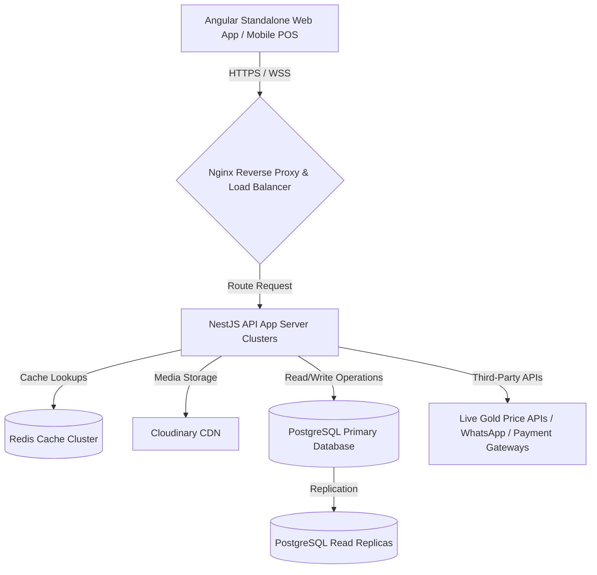

# Technical Architecture Document
## Multi-Tenant Gold & Jewelry SaaS ERP System

---

## 1. System Topology Overview

The system uses a modern, distributed micro-services or modular-monolith topology designed for high availability, multi-tenant security isolation, and rapid transactional execution.



---

## 2. Frontend Architecture (Angular)

The frontend is built with the latest version of Angular, utilizing standalone architectures to eliminate module overhead, Signals for reactive state management, and the NgRx Signal Store.

### 2.1. Standalone Core Structure
All views, dialogues, and components are standalone. Sub-routing is defined directly in configuration arrays:

```typescript
// app.routes.ts
import { Routes } from '@angular/router';

export const routes: Routes = [
  {
    path: 'dashboard',
    loadComponent: () => import('./features/dashboard/dashboard.component').then(m => m.DashboardComponent),
    canActivate: [AuthGuard]
  },
  {
    path: 'pos',
    loadComponent: () => import('./features/pos/pos.component').then(m => m.PosComponent),
    canActivate: [AuthGuard]
  }
];
```

### 2.2. State Management (NgRx Signal Store)
Below is the architectural implementation of the `InventoryStore` using Signals to manage reactive state:

```typescript
import { signalStore, withState, withMethods, patchState } from '@ngrx/signals';
import { inject } from '@angular/core';
import { InventoryService } from './services/inventory.service';
import { InventoryItem } from './models/inventory.model';

export interface InventoryState {
  items: InventoryItem[];
  isLoading: boolean;
  error: string | null;
}

const initialState: InventoryState = {
  items: [],
  isLoading: false,
  error: null
};

export const InventoryStore = signalStore(
  { providedIn: 'root' },
  withState(initialState),
  withMethods((store, inventoryService = inject(InventoryService)) => ({
    async loadInventoryByBranch(branchId: string) {
      patchState(store, { isLoading: true });
      try {
        const items = await inventoryService.fetchByBranch(branchId);
        patchState(store, { items, isLoading: false });
      } catch (err: any) {
        patchState(store, { error: err.message, isLoading: false });
      }
    }
  }))
);
```

---

## 3. Backend Architecture (NestJS)

The backend is a NestJS application built with TypeScript, featuring domain-driven modular structure.

### 3.1. Directory Structure
```
src/
├── app.module.ts
├── core/
│   ├── database/          # PostgreSQL Connection Pool & RLS Manager
│   ├── decorators/        # CurrentUser, CurrentTenant custom parameters
│   └── guards/            # JWTAuthGuard, RolesGuard
└── modules/
    ├── auth/              # JWT issuance and session controls
    ├── gold-rates/        # Commodity feed aggregator
    ├── inventory/         # Barcode engine and weight audits
    └── sales/             # POS pricing formulas and transactions
```

### 3.2. Dynamic Multi-Tenant Database Context Guard
NestJS utilizes a Request-scoped interceptor to extract `X-Tenant-ID` and inject the transaction context directly into the PostgreSQL thread session:

```typescript
// tenant.interceptor.ts
import { Injectable, NestInterceptor, ExecutionContext, CallHandler } from '@nestjs/common';
import { Observable } from 'rxjs';
import { DatabaseService } from '../core/database/database.service';

@Injectable()
export class TenantInterceptor implements NestInterceptor {
  constructor(private readonly dbService: DatabaseService) {}

  async intercept(context: ExecutionContext, next: CallHandler): Promise<Observable<any>> {
    const request = context.switchToHttp().getRequest();
    const tenantId = request.headers['x-tenant-id'];
    const userEmail = request.user?.email || 'anonymous';

    if (tenantId) {
      // Injects the current tenant context for PostgreSQL Row-Level Security policies
      await this.dbService.setSessionContext(tenantId, userEmail);
    }
    return next.handle();
  }
}
```

---

## 4. UI/UX Design & Screen Layouts

All screens follow a responsive grid structure using Angular Material design tokens.

### 4.1. POS / Sales Screen
* **Layout**: Split screen. Left Panel (70%): Search Bar, Interactive Scanned Item Table, Gold Exchange Input. Right Panel (30%): Live Rates Ticker, Payment calculator, Customer KYC indicator, and "Complete Order" trigger.
* **Flow**:
  1. Scan barcode $\rightarrow$ Event fetches product info $\rightarrow$ Calculates metal price in real time based on active rate $\rightarrow$ Populates table row.
  2. Select Customer $\rightarrow$ Checks KYC status. If buyback exceeds regulatory limits, highlights a document upload field.
  3. Enter Payment details $\rightarrow$ Click checkout $\rightarrow$ System updates status, locks inventory, and issues invoice via WhatsApp.
* **Validation**: Net cash/credit balances must balance exactly.

### 4.2. Inventory Screen
* **Layout**: Master-Detail panel. Top: Branch select, quick count tiles (Total Weight, Total Pieces, Shrinkage Alerts). Middle: Searchable data table showing items, weights, and karat filters. Bottom: Detail modal showing diamond certificates and logs.
* **Flow**:
  1. Click "Add Item" $\rightarrow$ Open Modal $\rightarrow$ Enter barcode $\rightarrow$ Enter weights.
  2. If Diamond category selected, display optional sub-fields for carat color, clarity, and cert number.
* **Validation**: Gross Weight must be greater than Net Gold Weight.

---

## 5. Third-Party API Integrations

The system leverages third-party REST APIs to orchestrate key business processes:

* **Live Gold Rates**:
  * *Service Provider*: `GoldAPI.io` or `MetalpriceAPI`.
  * *Function*: Poll rates every 60 seconds. Cache values in Redis.
* **Communication Channels**:
  * *Service Provider*: `Twilio API` (for SMS verification codes), `WhatsApp Business API` (for PDF invoice notifications).
* **Payment Gateways**:
  * *Service Provider*: `Stripe API` or `Adyen` (supporting split merchant routing per tenant).
* **Cloud Storage**:
  * *Service Provider*: `Cloudinary API` (for product images and customer ID verification documents).

---

## 6. System Security & Audit Compliance

* **JWT Verification**: Short-lived Access Tokens (15 mins duration) + Cryptographically signed Refresh Tokens (7 days duration) stored in HTTP-only, secure cookies.
* **SQL Injection Prevention**: Forced database parameterization via TypeORM/Knex queries.
* **XSS / Content Security Policy (CSP)**: Stripping raw HTML inputs, blocking unsafe inline scripts, and sanitizing user upload documents.
* **Rate Limiting**: IP and Tenant-based rate limits (`nestjs/throttler` package) configured to allow a maximum of 100 requests per minute per user session (excluding POS checkout endpoints, which have independent queues).

---

## 7. Scalability & Caching Strategy

To support growth from 100 to 10,000 tenants, the backend utilizes horizontal scalability layers:

* **Redis Caching**:
  * Hot keys: Live gold prices (expired after 60s), tenant profile configuration rules, system roles, and permissions dictionary.
* **Database Scaling**:
  * **Read-Write Splitting**: Route writes to the primary PostgreSQL node, while routing report generations and query lookups to secondary read replicas.
  * **Partitioning**: Partition inventory audit logs and sales ledgers dynamically by year/month to keep indexes small enough to fit in RAM.
